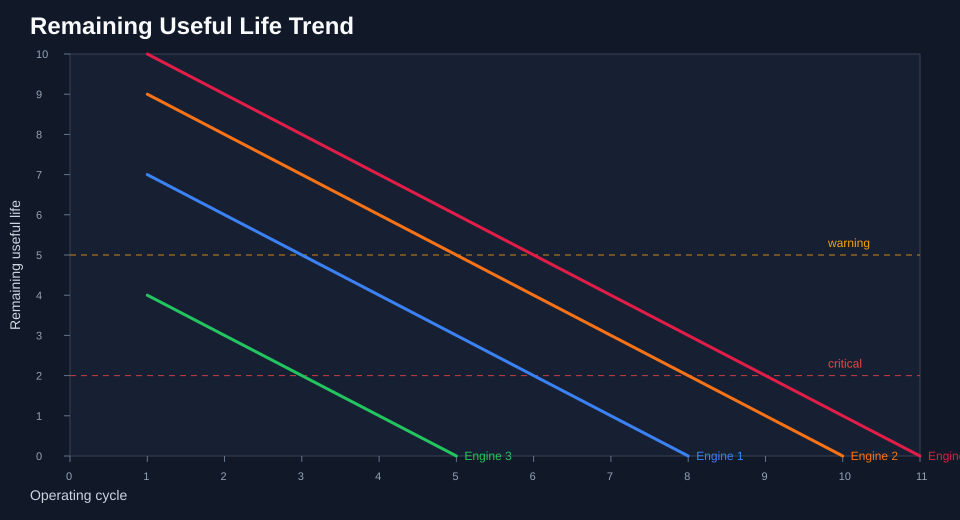
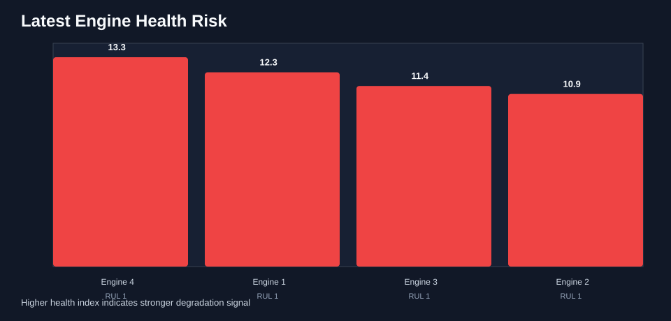

# Turbofan Degradation Analysis & RUL Prediction

Predictive-maintenance project for NASA CMAPSS-style turbofan engine degradation data. The pipeline calculates Remaining Useful Life (RUL), builds an explainable health index from sensor trends, trains a lightweight baseline RUL model, ranks engines by maintenance risk, and exports CSV, JSON, Markdown, and SVG reports.

This repo is designed as a polished aerospace data-science portfolio project: small enough to run immediately, structured enough to extend to the full NASA CMAPSS dataset.

## Problem

Turbofan engines degrade over operating cycles. Maintenance teams need to answer:

> Which engines are closest to failure, and how many cycles are likely left?

The project treats each engine's final observed cycle as its failure point and computes:

```text
RUL = max_cycle_for_engine - current_cycle
```

## Demo Outputs

The sample run creates visual outputs that summarize engine degradation and maintenance priority.





## What It Demonstrates

- CMAPSS-style data ingestion
- Row-level Remaining Useful Life calculation
- Sensor-based degradation health index
- Risk bands for maintenance prioritization
- Baseline RUL regression model
- Exported analysis artifacts for review
- Unit tests and GitHub Actions CI

## Repository Structure

```text
.
├── data/
│   └── sample_turbofan.csv
├── docs/
│   ├── assets/demo/
│   └── portfolio_walkthrough.md
├── results/
│   └── .gitkeep
├── src/
│   ├── analyze_turbofan.py
│   └── turbofan_rul/
│       ├── cli.py
│       ├── data.py
│       ├── features.py
│       ├── model.py
│       ├── pipeline.py
│       ├── reporting.py
│       └── visualization.py
├── tests/
│   └── test_pipeline.py
├── pyproject.toml
└── README.md
```

## Quick Start

Install the package:

```bash
python3 -m pip install -e .
```

Run the analysis on the included sample data:

```bash
turbofan-rul
```

Expected output:

```text
Turbofan RUL analysis complete
Rows analyzed: 34
Engines analyzed: 4
RMSE: ... cycles
MAE: ... cycles
Output directory: /path/to/results
```

Generated files:

- `results/latest_engine_scores.csv`
- `results/enriched_cycles.csv`
- `results/model_metrics.json`
- `results/summary.md`
- `results/rul_trend.svg`
- `results/engine_risk.svg`

## Run Against NASA CMAPSS Data

The loader accepts the included CSV sample or a whitespace-delimited NASA-style file such as `train_FD001.txt`.

```bash
turbofan-rul \
  --source data/raw/train_FD001.txt \
  --output-dir results
```

Large NASA files should stay out of Git and live under `data/raw/`.

## Example Summary Table

The pipeline ranks the latest pre-failure observation for each engine:

| Engine | Latest Cycle | RUL | Risk | Health Index | Predicted RUL |
|---:|---:|---:|---|---:|---:|
| 4 | 10 | 1 | critical | 13.255 | 0.3 |
| 1 | 7 | 1 | critical | 12.3 | 0.9 |
| 3 | 4 | 1 | critical | 11.434 | 0.9 |
| 2 | 9 | 1 | critical | 10.925 | 1.7 |

## Tests

```bash
python3 -m unittest discover -s tests
```

## Notes

The included sample dataset is intentionally small so the project runs instantly. It demonstrates the complete workflow, but it is not a substitute for validating a production model on the full NASA CMAPSS FD001-FD004 datasets.

## License

MIT License.
